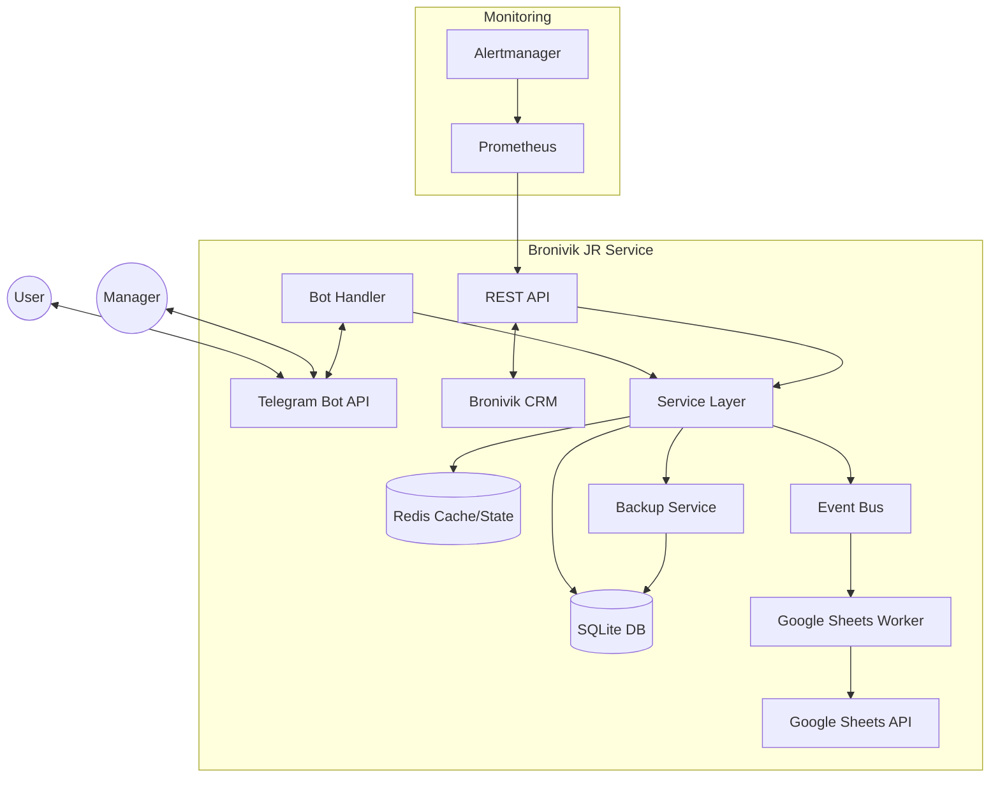

# Bronivik GO

Telegram-бот бронирований + API сервис (HTTP + gRPC) с интеграцией Google Sheets, SQLite (WAL) и Redis. В репозитории также есть отдельный бот для CRM-логики (почасовые кабинеты) — `bronivik_crm`.

## Требования

- Go 1.24+ (см. `go.mod` / toolchain)
- SQLite3 (по умолчанию)
- Redis 7+ (опционально, но рекомендуется)
- Google Cloud Service Account (опционально, если включена синхронизация в Sheets)

## Конфигурация

Основные параметры (`configs/config.yaml`):

```yaml
app:
  name: "bronivik-go"
  environment: "staging"  # production/staging
  version: "1.0.0"

telegram:
  bot_token: ${BOT_TOKEN}  # Обязательная переменная
  debug: true  # Включить логирование дебага

database:
  path: "./data/bookings.db"  # SQLite по умолчанию
  postgres:  # Опционально для PostgreSQL
    host: "localhost"
    user: ${BOT_USER}
    password: ${BOT_PASSWORD}

google:
  credentials_file: ${GOOGLE_CREDENTIALS_FILE}  # Путь к JSON-ключу Google API
  bookings_spreadsheet_id: ${BOOKINGS_SPREADSHEET_ID}
```

## Переменные окружения (`.env`)

Рекомендуемый старт: скопировать шаблон и заполнить.

```bash
cp .env.example .env
```

```bash
# Обязательные:
BOT_TOKEN=your_telegram_token

# Если используете Google Sheets:
GOOGLE_CREDENTIALS_FILE=/app/certs/credentials.json
USERS_SPREADSHEET_ID=
BOOKINGS_SPREADSHEET_ID=

# API auth (bronivik_crm -> bronivik_jr HTTP API)
CRM_API_KEY=
CRM_API_EXTRA=

# Опциональные (для PostgreSQL):
BOT_USER=
BOT_PASSWORD=
POSTGRES_DB=
```

## Запуск

### Docker Compose (рекомендуется)

1) Подготовьте `.env` и конфиги.

2) Если используете Google Sheets — положите JSON ключ сервисного аккаунта в `./certs/credentials.json` и выставьте `GOOGLE_CREDENTIALS_FILE=/app/certs/credentials.json`.

3) Запуск:

```bash
docker compose up -d --build
```

Сервисы:

- `telegram-bot`: основной Telegram бот
- `grpc-api`: API сервис (HTTP + gRPC)
- `crm-bot`: CRM Telegram бот (почасовые кабинеты)
- `redis`: Redis

### Локально (Go)

```bash
# Установка зависимостей
go mod tidy

# Бот
go run ./cmd/bot --config=configs/config.yaml

# API (HTTP + gRPC)
go run ./cmd/api --config=configs/config.yaml
```

## Команды бота

### Пользовательские команды

`/start` - Начало работы, проверка статуса броней  
`/book [дата] [время]` - Создать новую бронь (пример: `/book 2023-12-31 20:00`)  
`/my_bookings` - Показать активные брони  
`/cancel_booking [ID]` - Отменить бронь  
`/help` - Справка по командам

### Административные команды

`/approve [ID]` - Подтвердить бронь  
`/ban_user [ID]` - Добавить в черный список  
`/export_bookings` - Экспорт броней в Google Sheets  
`/stats` - Статистика бронирований  
`/system_info` - Техническая информация сервиса

❗ *Административные команды доступны только пользователям из списка managers (configs/config.yaml)*

```markdown
**Пример сценария бронирования**:

```bash
1. Пользователь: /book 2024-01-15 19:30
2. Бот: Запрос подтверждения данных
3. Менеджер: /approve 12345
4. Бот: Уведомление об успешной брони
```

## Мониторинг и health checks

- Метрики Prometheus (API): `http://localhost:9090/metrics`
- Liveness (API): `http://localhost:8080/healthz`
- Readiness (API): `http://localhost:8080/readyz`
- CRM бот health: `http://localhost:8090/healthz` и `http://localhost:8090/readyz`

## Основные функции

✅ Управление списком менеджеров (configs/config.yaml: `managers`)  
🚫 Черный список пользователей (configs/config.yaml: `blacklist`)  
📊 Интеграция с Google Sheets через сервисный аккаунт  

## HTTP API (для интеграций)

The bot provides a REST API for integration with other services (e.g., `bronivik_crm`).

### Endpoints

- `GET /api/v1/availability/{item_name}?date=YYYY-MM-DD`
  - Returns availability status for a specific item on a given date.
  - Response: `{"available": true, "booked_count": 1, "total": 2}`
- `GET /api/v1/availability/bulk`
  - Bulk check availability for multiple items and dates.
- `GET /api/v1/items`
  - List all active items with their total quantities.
- `GET /healthz` — liveness probe.
- `GET /readyz` — readiness probe (DB/Redis/Sheets).

### Authentication

Если включён `api.auth.enabled`, то запросы должны содержать ДВА заголовка:

- `X-API-Key`
- `X-API-Extra`

```bash
curl \
  -H "X-API-Key: $CRM_API_KEY" \
  -H "X-API-Extra: $CRM_API_EXTRA" \
  http://localhost:8080/api/v1/items
```

## Architecture



The system consists of:

- **Telegram Bot**: Main interface for users and managers, built with `telegram-bot-api/v5`.
- **REST API**: Integration point for external services (like `bronivik_crm`), providing availability checks.
- **SQLite**: Primary persistent storage for bookings, items, and users. Uses WAL mode for concurrency.
- **Redis**: State management for user flows and rate limiting. Includes an in-memory failover.
- **Google Sheets Worker**: Asynchronous synchronization of bookings to Google Sheets using a task queue.
- **Backup Service**: Automatic daily backups of the SQLite database using `VACUUM INTO`.
- **Event Bus**: Decouples business logic from side effects like synchronization and notifications.

## Development

```bash
# Run tests
make test

# Check coverage
make test-coverage

# Run linter
make lint
```

## Deployment Guide

### 1. Prerequisites

- Docker and Docker Compose
- Google Cloud Service Account JSON key
- Telegram Bot Token (from @BotFather)

### 2. Configuration

1. Copy `configs/config.yaml` and update the values.
2. Set up environment variables in a `.env` file (see `.env.example`):

```bash
BOT_TOKEN=your_token
GOOGLE_CREDENTIALS_FILE=/app/certs/credentials.json
CRM_API_KEY=...
CRM_API_EXTRA=...
```

### 3. Running with Docker

```bash
docker compose up -d --build
```

### 4. Monitoring

Access metrics at `http://localhost:9090/metrics`. Alerting rules are provided in `monitoring/alerts.yml`.

## License

[МПЛ 2.0](https://www.apache.org/licenses/LICENSE-2.0)

---

Важно: перед деплоем в production:

1. Установите `environment: production`
2. Отключите `telegram.debug`
3. Настройте SSL для PostgreSQL
4. Обновите `managers_contacts`

При разработке (быстрый цикл):

```bash
git pull
docker compose down
docker compose up -d --build
docker compose logs -f booking-bot
```
